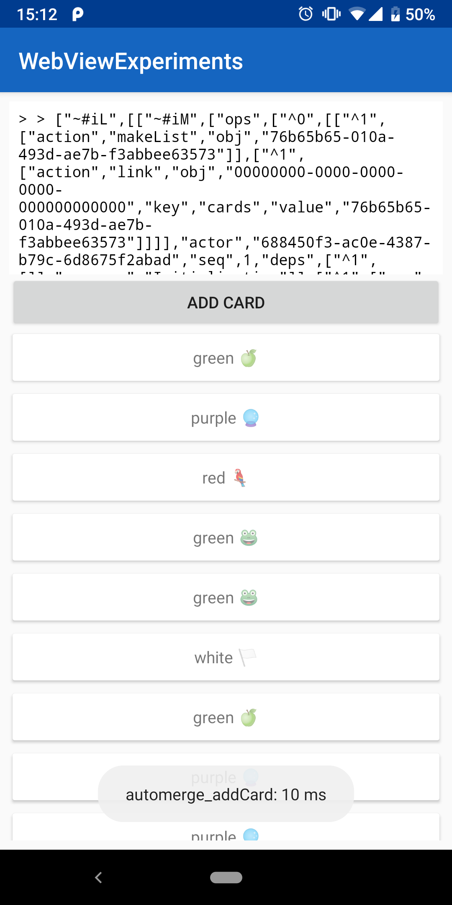

# Android Automerge Experiment

This sample project includes the [Automerge](https://github.com/automerge/automerge) dist bundle as an asset to an Android project. The JS file is loaded through a HTML document inside a webview with a few application specific methods and callbacks.

Input (e.g. inserting a card) is injected as JS evaluations into the WebView. There the automerge document is modified. All these changes then callback into the Android-Kotlin-world via a `@JavascriptInterface` method.

## Setup

- Make sure your Android SDK and AndroidStudio are working properly (e.g. build and install the sample project)
- Clone this repository
- Either:
  - Open in AndroidStudio and hit the run button after initialisation has finished (preferred)
  - Run `./gradlew installDebug` from the CLI

## Screenshot

